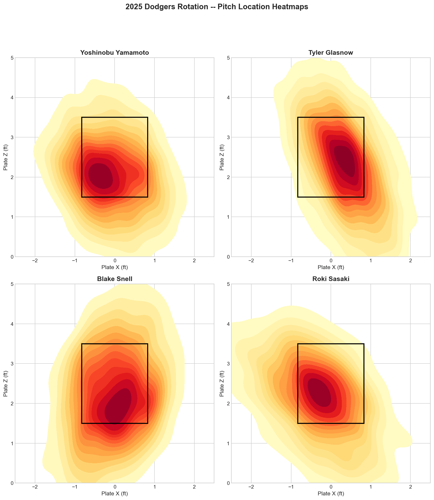
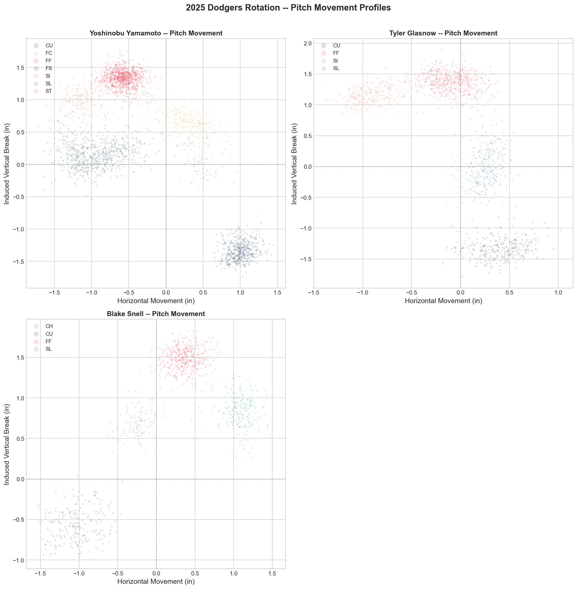

# Bayesian Hierarchical Model for Pitch-Level Expected Run Value

[](https://github.com/arios37/statcast-bayesian-pitch-model/actions/workflows/ci.yml)
[](LICENSE)
[](https://www.python.org/downloads/)

A Bayesian hierarchical regression that estimates the expected run value of every pitch thrown in the 2025 MLB season, using Statcast tracking data from Baseball Savant. The model produces **posterior distributions**, not point estimates -- every prediction comes with calibrated uncertainty. Includes a deep dive on the 2026 LA Dodgers pitching staff.

---

## Results

### Posterior Predictive Check

The model's posterior predictive distribution (blue) envelopes the observed `delta_run_exp` distribution (black), confirming the model captures the data-generating process.


### Shrinkage Plot

Partial pooling in action. High-volume pitchers stay near the diagonal (little shrinkage). Low-volume pitchers are pulled toward the league mean (strong shrinkage). This is the core value proposition of hierarchical modeling over raw averages.


### Fixed Effects (Posterior Forest)

Standardized coefficients with 94% HDI. Coefficients with intervals entirely away from zero represent clear effects. Magnitudes are directly comparable because all predictors are standardized.


### Pitcher Random Effects (Top 40)

Each pitcher's posterior intercept distribution. Tight intervals = high-volume, reliable estimate. Wide intervals = low-volume, heavily regularized by the hierarchical prior.


### Dodgers Deep Dive

Pitch location heatmaps and movement profiles for the 2026 Dodgers rotation, built from their 2025 Statcast data.





---

## What This Does

A four-stage pipeline from raw Statcast data to Bayesian inference:

| Stage | What Happens | Key Output |
|-------|-------------|------------|
| **Extract** | Pull 700K+ pitches from Baseball Savant via `pybaseball` | Raw Statcast DataFrame |
| **Engineer** | Build model features: platoon splits, count leverage, stuff composite, location zones, base state | Scaled feature matrix with pitcher indices |
| **Model** | Fit PyMC hierarchical regression with pitcher random intercepts, NUTS sampling | ArviZ InferenceData with posterior + posterior predictive |
| **Analyze** | Posterior predictive checks, shrinkage plots, ML baseline comparison, Dodgers rotation analysis | Figures, diagnostics, pitcher-level effect estimates |

---

## Features Engineered

| Feature | Description | Baseball Rationale |
|---------|-------------|-------------------|
| Platoon advantage | Binary flag: same-hand pitcher-batter matchup | RHP vs RHB is a fundamentally different at-bat than RHP vs LHB |
| Count leverage | Numeric encoding of the 12 ball-strike states | A 3-0 pitch and a 0-2 pitch have completely different run expectancy implications |
| Stuff composite | Z-scored velocity + horizontal/vertical movement within pitch type | A 95 mph fastball with 18" of induced vertical break is elite stuff regardless of era |
| Location zones | Heart / edge / chase / waste classification from plate coordinates | Middle-middle fastballs and low-and-away sliders produce categorically different outcomes |
| Base state | Integer 0--7 encoding of all 8 runner configurations | Runners on base shift the entire run expectancy landscape for every pitch |

---

## Model Specification

```
y ~ Normal(mu, sigma)

mu = alpha_pitcher[j] + X * beta

alpha_pitcher[j] ~ Normal(mu_alpha, sigma_alpha)   # pitcher random effects
mu_alpha ~ Normal(0, 0.1)                           # league-level mean
sigma_alpha ~ HalfNormal(0.05)                      # between-pitcher variance

beta ~ Normal(0, 0.1)                               # fixed effects (10 predictors)
sigma ~ HalfNormal(0.1)                             # observation noise
```

Non-centered parameterization (`alpha_pitcher = mu_alpha + sigma_alpha * offset`) for clean MCMC geometry. Sampled with NUTS, 4 chains, 1000 draws + 500 tune.

### Why Hierarchical

MLB has ~800 pitchers in a season. Some throw 3,000+ pitches. Some throw 50. A model that treats each pitcher independently will overfit on the small samples and miss the signal on the large ones. Hierarchical modeling solves this by borrowing strength across the population. The math handles what your intuition already knows: a guy who threw 50 pitches and looked elite probably isn't actually that elite. The model knows how much to trust each sample.

---

## ML Baseline Comparison

The Bayesian model is compared against three frequentist baselines. The point isn't that Bayes wins on RMSE -- it's that the Bayesian model provides **full posterior distributions** while baselines give you a single number.

| Model | RMSE | MAE | R-squared | CV RMSE (mean) | CV RMSE (std) |
|-------|------|-----|-----------|----------------|---------------|
| Linear Regression | 0.2223 | 0.1197 | 0.0004 | 0.2224 | 0.0015 |
| Random Forest | 0.2073 | 0.1015 | 0.1311 | 0.2203 | 0.0013 |
| Gradient Boosting | 0.2006 | 0.1012 | 0.1868 | 0.2229 | 0.0015 |

---

## 2026 Dodgers Roster

The Dodgers deep dive uses the current 2026 roster (post-2025 offseason) analyzed against their 2025 Statcast data. Some pitchers (Sasaki, Ohtani as pitcher) may have limited or no 2025 MLB pitching data.

| Pitcher | Role | MLBAM ID |
|---------|------|----------|
| Yoshinobu Yamamoto | SP | 808967 |
| Tyler Glasnow | SP | 607192 |
| Shohei Ohtani | SP | 660271 |
| Blake Snell | SP | 605483 |
| Roki Sasaki | SP | 808963 |
| Emmet Sheehan | SP | 686218 |
| Edwin Diaz | RP | 621242 |
| Tanner Scott | RP | 656945 |
| Blake Treinen | RP | 595014 |
| Alex Vesia | RP | 681911 |
| Evan Phillips | RP | 623465 |
| Gavin Stone | RP | 694813 |
| Edgardo Henriquez | RP | 683618 |

---

## Diagnostics

Full MCMC diagnostic suite at every stage:

| Check | Threshold | Purpose |
|-------|-----------|---------|
| R-hat | < 1.01 | Chain convergence -- all chains exploring the same posterior |
| ESS (bulk) | > 400 | Effective sample size -- enough independent draws for reliable estimates |
| Divergences | 0 | Sampler geometry -- no pathological regions in the posterior |
| Posterior predictive | Visual | Model reproduces the observed `delta_run_exp` distribution |
| Trace plots | Visual | Chains are mixing well, no stuck regions |
| Shrinkage plot | Visual | Partial pooling behaves as expected across sample sizes |

---

## Project Structure

```
statcast-bayesian-pitch-model/
├── .github/
│   └── workflows/
│       └── ci.yml                  # Ruff lint + pytest on push (Python 3.10, 3.11)
├── notebooks/
│   ├── 01_data_acquisition.ipynb         # Pull + clean 2025 Statcast data via pybaseball
│   ├── 02_eda_and_feature_engineering.ipynb  # EDA visualizations + feature engineering
│   ├── 03_bayesian_model.ipynb           # PyMC model build + MCMC sampling
│   └── 04_results_and_diagnostics.ipynb  # Posteriors, baselines, Dodgers deep dive
├── src/
│   ├── data.py         # pybaseball pull, cleaning, parquet caching
│   ├── features.py     # Platoon, count leverage, stuff composite, location zones
│   ├── baseline.py     # ML baselines (Linear, RF, GBM) with cross-validation
│   ├── model.py        # PyMC hierarchical model definition + diagnostics
│   └── visualize.py    # Pitch heatmaps, forest plots, posterior checks
├── tests/
│   ├── test_data.py        # Data pipeline validation
│   ├── test_features.py    # Feature engineering (42 assertions)
│   ├── test_baseline.py    # ML baseline output format checks
│   └── test_model.py       # Model compilation, structure, coords
├── figures/            # Generated visualizations (committed)
├── data/               # Parquet + NetCDF files (gitignored, ~200MB)
├── pyproject.toml      # Dependencies + ruff/pytest config
├── LICENSE             # MIT
└── README.md
```

---

## Quick Start

```bash
# Clone
git clone https://github.com/arios37/statcast-bayesian-pitch-model.git
cd statcast-bayesian-pitch-model

# Create virtual environment
python3 -m venv .venv
source .venv/bin/activate

# Install dependencies
pip install -e ".[dev]"

# Run tests (42 tests, all passing)
pytest tests/ -v

# Lint
ruff check src/ tests/

# Start with notebook 01 (data pull takes ~5 min)
jupyter notebook notebooks/01_data_acquisition.ipynb
```

### Make Targets (Optional)

If you prefer `make`:

```bash
make test       # pytest tests/ -v
make lint       # ruff check src/ tests/
make clean      # remove data/, figures/, __pycache__
```

---

## Tech Stack

| Tool | Purpose |
|------|---------|
| **PyMC 5.10+** | Probabilistic programming, NUTS sampler, posterior predictive |
| **ArviZ** | MCMC diagnostics, InferenceData, trace/forest/rank plots |
| **pybaseball** | Statcast API wrapper for Baseball Savant data |
| **scikit-learn** | ML baselines (Linear, RF, Gradient Boosting), cross-validation |
| **pandas / NumPy** | Data manipulation, feature engineering |
| **matplotlib / seaborn** | Static visualizations, pitch heatmaps |
| **pytest** | 42-test suite covering data, features, model, baselines |
| **ruff** | Linting (pycodestyle, pyflakes, isort, bugbear, naming) |
| **GitHub Actions** | CI on push: lint + test across Python 3.10, 3.11 |

---

## License

[MIT](LICENSE)
